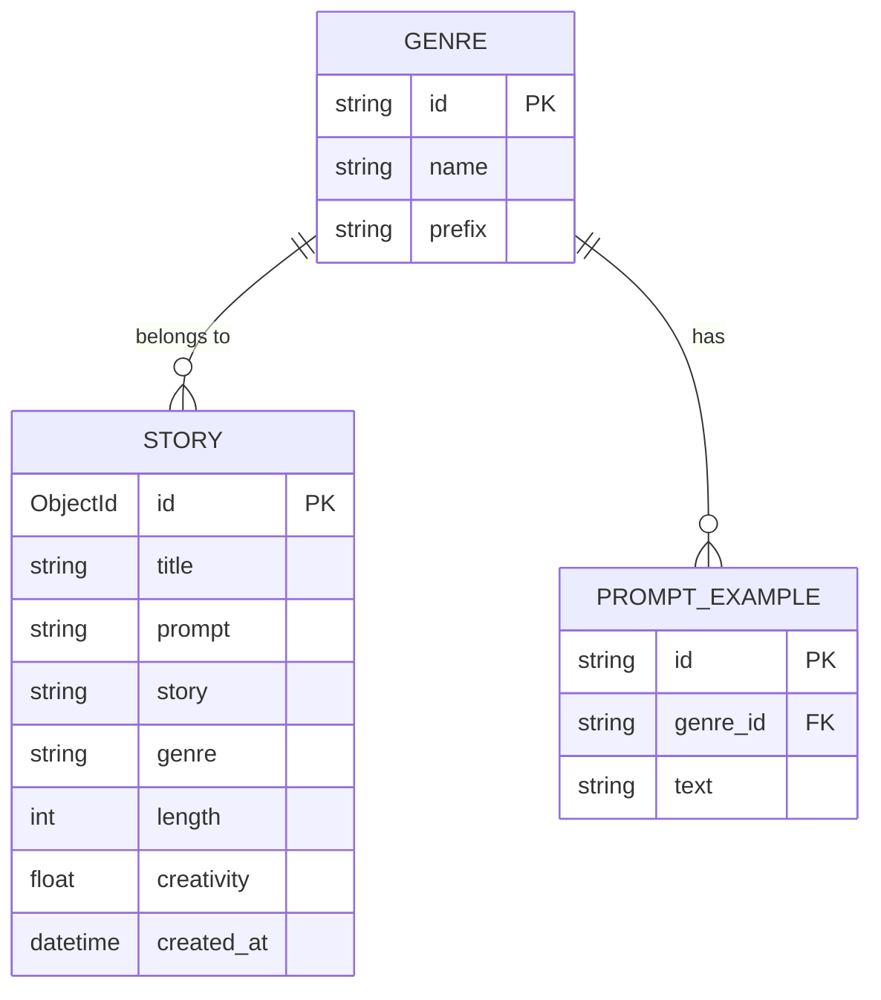
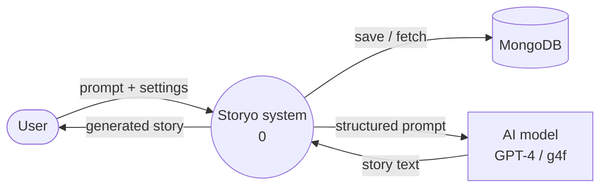
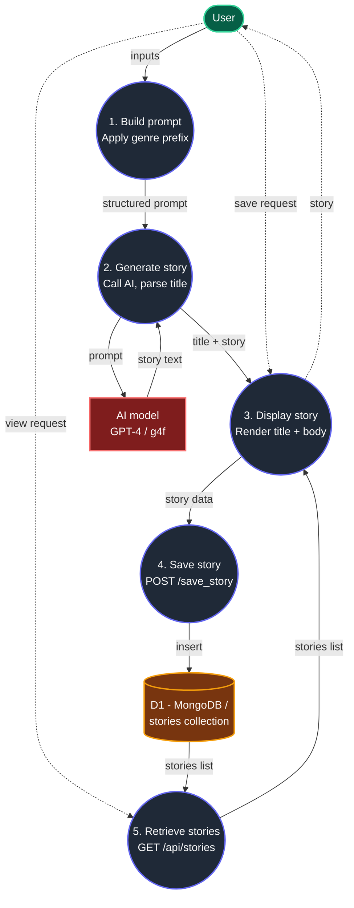

# Storyo Project Documentation

## 1. System Request
**Project Name:** Storyo
**Project Sponsor:** Business Stakeholder / End Users
**Business Need:** There is a growing demand for creative writing assistance and automated, personalized storytelling. Users need an accessible platform to quickly generate stories with tailored parameters (genre, length, creativity level) to spark inspiration, read for entertainment, or assist in creative writing.
**Business Requirements:** 
- The system must capture user inputs including a story prompt and configuration settings (genre, text length, and creativity level).
- The system must interact seamlessly with an AI model (like GPT-4 or g4f) to turn the prompt into a structured story with a title and body.
- The system must provide functionality to save generated stories into a database (MongoDB) for long-term storage.
- The system must allow users to retrieve and view their previously generated stories.
**Business Value:** Provides an engaging platform that acts as a boundless source of inspiration, entertaining readers and assisting writers, leading to potential user retention and future monetization opportunities.

## 2. Feasibility Study
**Technical Feasibility:** 
- The required technologies (AI inference APIs like GPT-4, MongoDB for scalable document storage, and modern web frameworks for the UI) are mature, reliable, and well-understood. 
- The system architecture outlined in the DFD is standard for modern web applications. 
- Technical risk is low to moderate, mainly tied to AI response times and API rate limits.

**Economic Feasibility:** 
- Development requires standard full-stack engineering effort. 
- Operational costs cover database hosting and AI API usage. Utilizing models like `g4f` can initially offset high AI API costs.
- Expected benefits: High organic user engagement due to the popularity of AI generation tools, opening pathways for premium subscription tiers.

**Organizational/Operational Feasibility:** 
- The application is intuitively designed: users enter a prompt and receive a story.
- Requires no specialized training for the end-user.
- Aligns perfectly with current technological trends favoring AI-assisted creative tools.

## 3. Interview (Mock Requirements Gathering)
**Interviewer:** Systems Analyst
**Interviewee:** Project Lead

**Q: What is the core functionality you want to achieve with the Storyo app?**
A: We want to give users an effortless interface where they can generate custom stories. They provide a prompt and pick parameters like genre, length, and creativity, and the app handles the rest.

**Q: How do you plan to handle the story generation under the hood?**
A: The user's inputs are first processed to build a structured prompt, appending any genre-specific prefixes. This compiled prompt is then sent to our AI model (GPT-4 or a g4f equivalent). The AI returns raw story text which we format into a title and the main story body for display.

**Q: How is data storage managed?**
A: We're using MongoDB since the unstructured/semi-structured nature of stories fits well with NoSQL. Whenever a user wants to save a story, we grab the generated data plus their original prompt and settings, and insert it into a `stories` collection. Users can also retrieve their saved stories later.

**Q: Could you detail the main database entities?**
A: Sure. The main entity is the `STORY`, holding everything from title, the prompt, constraints, to the actual text. We also have `GENRE` to store different genre types and their specific prompt prefixes, and `PROMPT_EXAMPLE` to hold example texts tied to a genre.

## 4. Entity Relationship Diagram (ERD)

Based on the provided schema, here is the Entity Relationship Diagram representing the data objects.

## 5. Data Flow Diagram (DFD)

### Level 0 — Context Diagram
This diagram depicts the Storyo system as a single process and illustrates its interactions with external entities.

### Level 1 — Process Decomposition
This diagram breaks down the main system into specific functional processes and outlines the flow of data between them.

